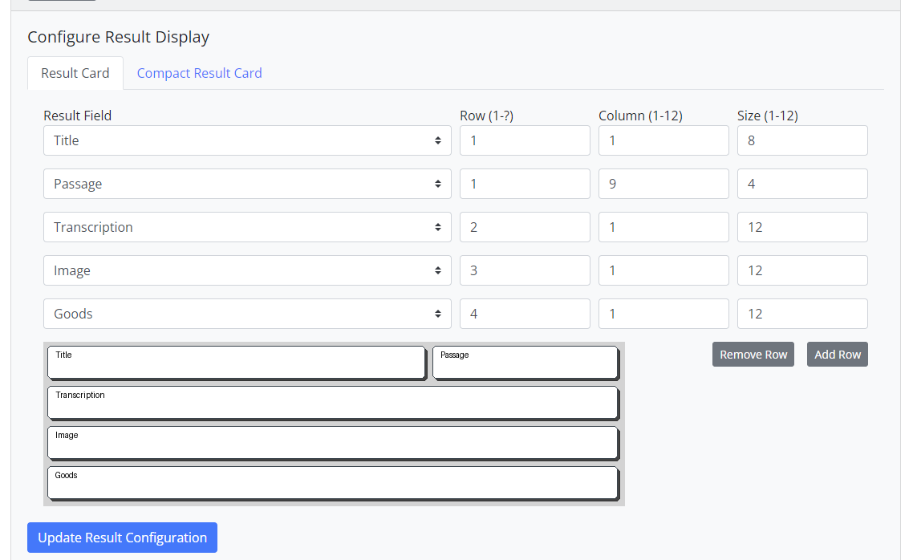

NDR's Markup Language
=====================
NDR Core features a markup language which can be used to style the data in the result
display and to create links to other pages, images or resources. This chapter does not
directly refer to a section of the administration interface because markup tags can be
used in several places. In general, there are two variants of markup tags: **CMS** and
data-display tags. The Content Management System tags are used to create links to
other pages, images or resources or to call User Interface elements.

The system is created thusly: there is a data object, a render template and a calling
function for each element. This means that the system can be extended by adding a new
render template, implementing the calling function and specifying the data object type.
This is even easier for User Interface elements as the data object and calling function
are already implemented. The render templates are created with Django’s template
language and can also be overwritten by an installed NDR Core instance. This means
that instead of adding new elements, publishing them and updating the installation,
it is also possible to overwrite the rendering of an existing element and tailor it to the
needs of the project. The rendering of the cms tags is done last, when CkEditor and
Django have already rendered the page. There is a maximum of 50 cms tags per page.
The mechanism is designed as a while loop which iterates over the content and replaces
the tags with the rendered content. To prevent an infinite loop, the loop is limited to 50
iterations.

The data-display tags are used to render the data in the result display. The main difference
to cms tags is that they are designed to access a (nested) data field in a json object
and then apply filters to them. The data-display tags can be used to access the data in
this object and render it in a certain way. The main syntax is ``{data_key|filter}``. The
data_key is mandatory, filters can be applied and are optional. Filters can be simple
filters as just shown or complex filters with arguments. The filters can be chained and are
applied in the order they are written. If the object the data_key is pointing to is a list, the
filters are applied to every element of the list. The example in Figure 4.4 shows a person
dataset which might be what NDR Core gets from the API.

.. list-table:: CMS Tags
   :widths: 30 70
   :header-rows: 1

   * - Tag
     - Description
   * - ``[[page|<page_name>]]``
     - Creates a link to a page to an internal page and shows the page’s navigation label as link text. The parameter is the view_name of the page. Name is shown translated if applicable.
   * - ``[[file|<file_id>]]``
     - Creates a download link to an uploaded file. The file_id can be retrieved from the uploads section in the admin interface. File name is shown translated if applicable.
   * - ``[[figure|<image_id>]]``
     - Displays a figure from an uploaded image. This is a convenience tag, so one does not have to create a User Interface element for each image.
   * - ``[[start_block]] [[end_block]]``
     - Creates a block on a page to be filled with content. You can write text directly to the background of your page but most of the time it’s prettier to have background color and then create blocks on the page to structure your content.
   * - ``[[card|<elem_name>]] [[slideshow|<elem_name>]] [[carousel|<elem_name>]] [[jumbotron|<elem_name>]] [[banner|<elem_name>]] [[iframe|<elem_name>]] [[manifest_viewer|<elem_name>]]``
     - Creates a link to a User Interface element. Each element features a name which can be used to call it in your content. All Content Management System tags can be called multiple times, also on the same page. An exception is the manifest_viewer element; it can be called multiple times but the selection of manifests or pages will always apply to all viewers on a page.

The following examples
show how to access the data and render it in a certain way. They are formatted in Python
syntax to make it easier to understand, but can be used the search field expressions the
same way (without the double quotes).

::

    # results in "person-12345"
    str_id = "{id}"

    # results in "{’last_name’: ’Duck’, ’first_name’: ’Donald’}"
    str_name = "{name}"

    # results in "["prof-spec-1", "prof-manu-35"]"
    profs = "{professions}"

    # results in "prof-manu-35"
    first_prof = "{professions.1}"

    # results in "0000-0002-9541-1202"
    str_orcid = "{meta.created_by.id}"

As seen on lines 2 and 5, the variable name of a JSON object can be used to access
the data. The system returns the value of the variable. This value can be passed to a
filter in its current form (for line 2 this is a string, for line 5 this is a JSON object) When
it is rendered on the result display, all values are converted to a string. Lines 8, 11 and
20 show how to access a nested value. The different levels are separated by a dot. Lines
14 and 17 show how to access a list. Line 14 returns the whole list as a string (with
comma as a separator), line 17 returns the second element of the list (indexes start from
0). All these examples can be used as such or passed to one or more filters. Filters can
be simple and only have a name or complex and have positional or named arguments.
The following code listing shows examples of filters, their syntax and their output

::

    # results in "PERSON-12345"
    str_id = "{id|upper}"

    # results in "Unemployed, Coat button manufacturer"
    # ( assuming the professions are configured as in the example above )
    profs = "{professions|fieldify:professions}"

    # results in ~ "Unemployed"
    prof1 = "{professions.0|badge:field=professions,color=by_value}"

    # results in ""
    image = "{source.fragment|img}"

The first example shows a simple string filter. This one is called “upper” and converts the string to uppercase. The second example shows a complex filter with one
positional argument. It will take a value (or a list of values) and look up the search field
with the supplied name. This field needs to be a list-choice field and the filter will return
the value (or the list of values) of the field. So if you supply the key “prof-spec-1” it will
return “Unemployed” or “Arbeitslos” depending on the selected language. The fieldify
functionality is also implemented in other filters like the badge filter. The badge filter
does not need arguments, but they can be supplied. Because they are not mandatory, all
arguments are named and only the needed ones need to be supplied. A badge is a small
box with a colored background and some text.13 The badge filter takes the value of the
data key and looks up the search field with the supplied name. It then returns the value
of the field wrapped in the HTML code for a badge. By supplying the color argument,
the filter will color the badge with the color of the value. Another example of a typical
HTML filter is the img filter. It takes the value of the data key and returns the HTML
code for an image tag with the value as the src attribute.

.. list-table:: Data-Display Tags
   :widths: 30 70
   :header-rows: 1

   * - Tag
     - Description
   * - ``lower``
     - Converts the value to lowercase. Has no impact on numbers.
   * - ``upper``
     - Converts the value to uppercase. Has no impact on numbers.
   * - ``title``
     - Converts the value to title case. This means that the first letter of every word is
       capitalized. Has no impact on numbers.
   * - ``capitalize``
     - Converts the value to capitalize case. This means that the first letter of the first
       word is capitalized.
   * - ``fieldify:<field_name>``
     - Takes a value and looks up the search field with the supplied field name.
       Returns the (translated) value of the field.
   * - ``badge:field=,color=,bg=``
     - Takes a value and looks up the search field with the supplied field name. Returns the
       value of the field wrapped in the HTML code for a badge. If the field parameter
       is supplied, the filter will look up the field with the supplied name (like fieldify). Both
       color fields (color is for the text color, bg for the background color) can be supplied with
       a color value. See below how color values are handled.
   * - ``img:iiif_resize=``
     - Takes a value and returns the HTML code for an image tag with the value as the src attribute.
       If the image source is a IIIF image, the option iiif_resize can be applied. The value of this
       option needs to be a number between 0 and 100 and means the percentage of the original size.
   * - ``bool:<true_val>,<false_val>``
     - Takes a boolean value (or 0/1, on/off) and returns the true_val if the value is true and
       the false_val if the value is false.

Filters can be added to NDRCore by implementing the AbstractFilter class of the
system. The methods which need to be implemented define the number of mandatory
positional arguments and the possible named arguments. The most important method
is the “get_rendered_value” method which takes the value of the data key and the
arguments and returns the rendered value. See Listing 4.4 for a list of implemented filters.
NDRCore supplies base classes to use for these filters. For instance, there is a HTML
element class which can deal with different arguments and classes of an element provides
color management functionality for the different ways, colors can be supplied.
Colors are either supplied by giving a valid CSS color name, a hexadecimal color code
or a RGB/HSL color code. Additionally colors can be Bootstrap color names (primary, secondary, . . . )
or set to one of the following keywords: ``val__<field_name>``,
``byval__<field_name>`` or ``byval`` . See the following examples for an explanation of
these keywords.

::

    # results in Unemployed
    badge = "{professions.0|badge:field=professions,color=primary}"

    # Unemployed
    badge = "{professions.0|badge:field=professions,color=#112233}"

    # Unemployed
    badge = "{professions.0|badge:field=professions,color=val__mycolor}"

    # Unemployed
    badge = " { professions .0| badge : field = professions , color = byval__info } "

    # Unemployed
    badge = "{professions.0|badge:field=professions,color=byval}"

The first example shows the use of a color name, the second one shows the use of a
static color code. The next three examples use the value of the search field configuration
for the supplied key. This means, for example, that the value of ``{professions.0}`` is the
key "prof-spec-1". This functionality assumes, that in the professions search field, there
is a line with the key "prof-spec-1". In this line there is a value ("Unemployed") and
mycolor-column. The latter has the value "#123456" in this example. If the color keyword is
set to ``val__mycolor``, the filter will look up the value of the mycolor-column
and use it as the color. If the color keyword is set to ``byval__info``, the filter will look
up the value of the info-column and use it to calculate a color. The calculation is done
by taking the MD5 hash of the value and converting it to a HSL color code. The last
example ("byval") does this calculation with the key itself.

In conclusion, the NDR Core filter system may be a bit of a steep learning curve for
someone who is not used to work with this kind of syntax but it is as similar as possible
to the Python string formatting syntax and implemented in a flexible and extendable
way. Together with the grid system and the possibility of formatting with the CkEditor,
it allows for a lot of flexibility in the creation of result displays and is thus able to cater
to the very diverse needs of research projects.
