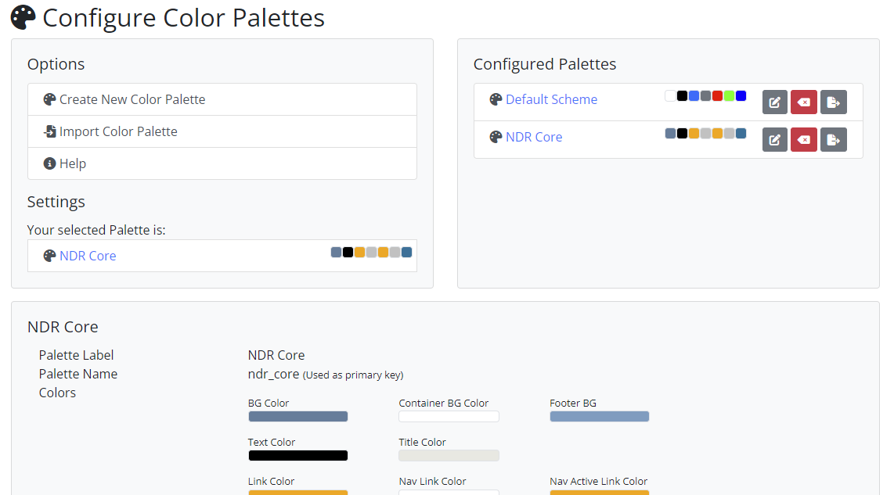

Style & Colors
==============
The style & colors section has two subsections: UI-Style and color management. The UI
style is the general layout of the page. Currently, three styles are available: Centered,
Left Navigation and Fixed Top Navigation. The first one is the default style and displays
the navigation bar at the top of the page in a centered manner. The second one displays
the navigation bar on the left side of the page and allows users to hide it. The last one
has a fixed navigation bar at the top of the page and the page content flows below it
when scrolling. Currently only the first style is fully supported, the other two are still in
development. The implementation of User Interface styles is designed as such that new
styles can be added and existing styles can be overwritten if needed. NDR Core User
Interface styles have a base template which defines the general layout of the page. This
base template is extended by the base template of the NDR project and all pages of the
website extend this base template. This allows for a simple way to overwrite the base
template of the NDR project and create a custom style. Each style has to implement a list
of template blocks to render the navigation bar, the footer, the page titles and its content.
Bootstrap allows for the creation of HTML code which is responsive to different screen
sizes. This means that NDR Core does not have the possibility to create a desktop and
a mobile version, but the User Interface style implementations can be designed to work
for both versions.

The color management section allows users to change the colors of the website. NDR
Core works with color palettes which can be selected, created and managed in this section.
Every color palette features a number of colors which can be used to style the
website. The colors are used to style all elements of the website and are also applied to
the content of the pages if not overwritten within the CkEditor. The color palettes are
implemented as Django models and can be extended to add more colors if needed.14
When a color palette is selected, a CSS file is generated that overwrites the default colors of the Bootstrap theme. This file is copied into the static files directory of the project
and is loaded by the base template. While possible, it is not recommended to change the
colors of the website via the CSS file because it gets overwritten when the color palette is
changed. If necessary, additional CSS files can be added to the static files directory and
loaded by the base template. The colors themselves are pretty self-explanatory; there
are colors for page, form and block backgrounds, text and link colors, two sets of button
colors and more.