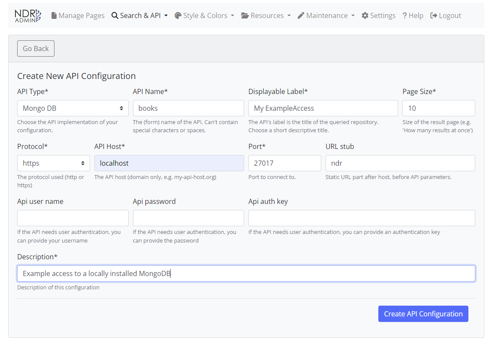
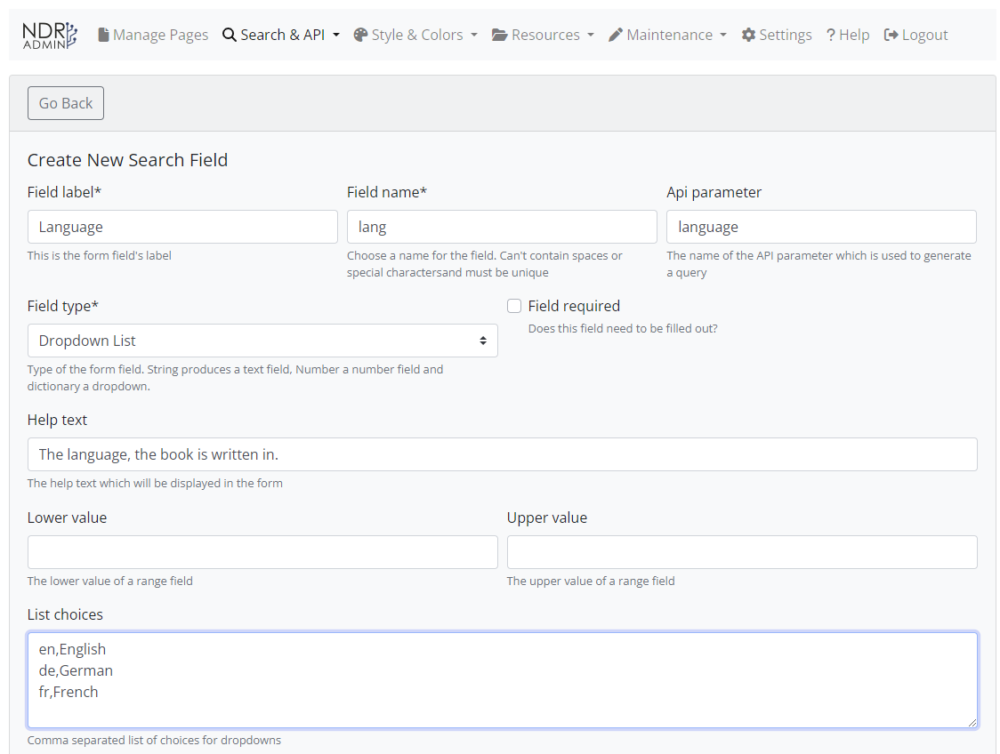

###############
Example Project
###############

.. note::

    This guide assumes you have a working NDR Core installation and access
    to data and IIIF imagery. If you do not, please see the :doc:`install-on-a-server`
    and :doc:`sample-data-base` guides.

This guide will walk you through the process of creating a new project in NDR Core. We will
create a project for the dataset described in: :doc:`sample-data-base`.

Create API Access Configuration
===============================

First, access the NDR Core admin interface at ``http://localhost:8000/ndr_core`` or at
``http://<your-domain>/ndr_core`` and log in with the default credentials:

* Username: ``ndr_core_admin``
* Password: ``ndr_core``

Now we need to configure the access to the data. Click on ``Search & API`` in the top menu
and then on ``Configure API``. Select ``Create New API Access Configuration`` and fill in the
form as follows:

Create Search Fields
====================

Create Search Configuration
===========================
TODO

Create Search Page
==================
TODO